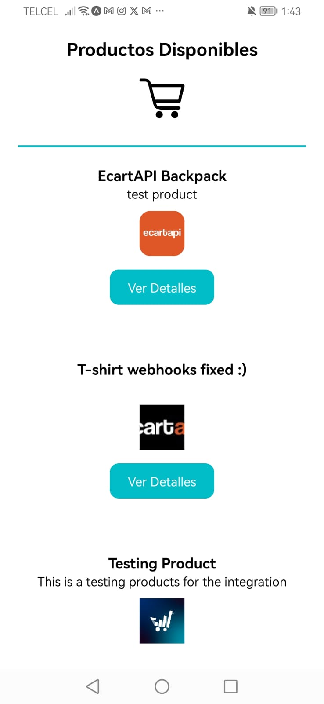
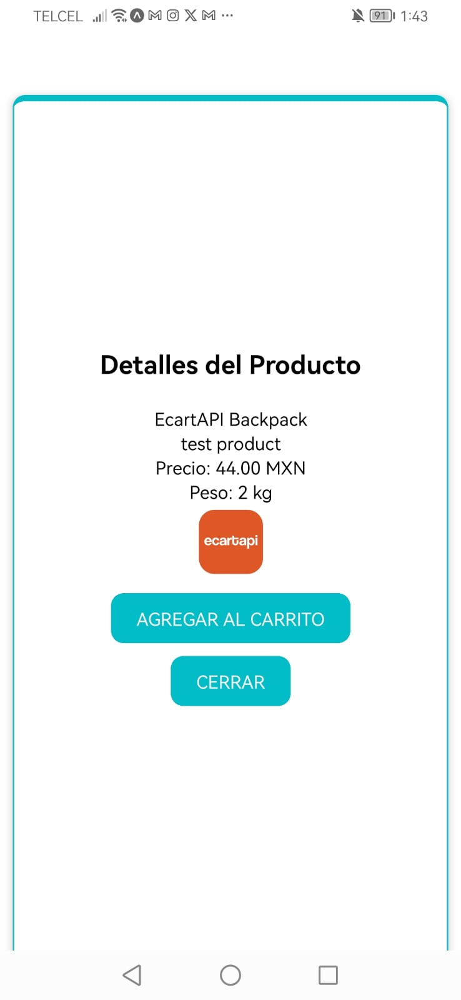
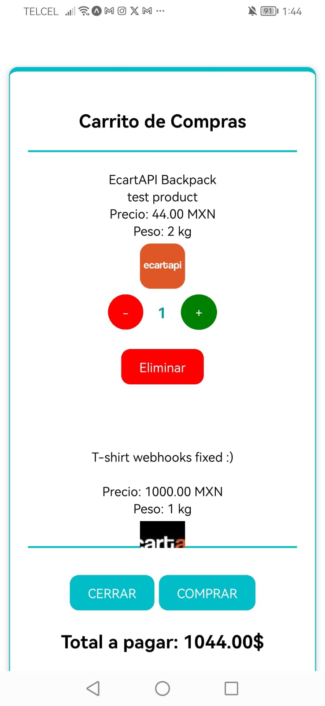

# E-commerce App ReactNative

Este proyecto es una aplicación móvil desarrollada con React Native que permite a los usuarios realizar compras en línea de una variedad de productos. La aplicación muestra una lista de productos disponibles, permite a los usuarios ver detalles de cada producto, agregar productos al carrito de compras, ver el carrito de compras con los productos seleccionados, ajustar las cantidades de los productos en el carrito, eliminar productos del carrito y realizar el pago.

La aplicación utiliza la librería Axios para realizar solicitudes HTTP a una API externa que proporciona los datos de los productos. Los datos de los productos incluyen información como nombre, descripción, precio, imagen, etc. Además, la aplicación utiliza modales para mostrar detalles de los productos, el carrito de compras y mensajes de confirmación.

## Funcionalidades Principales

- Mostrar una lista de productos disponibles.
- Permitir a los usuarios ver detalles de los productos.
- Agregar productos al carrito de compras.
- Ver el carrito de compras con los productos seleccionados.
- Ajustar las cantidades de los productos en el carrito.
- Eliminar productos del carrito.
- Realizar el pago.

## Capturas de Pantalla





## Tecnologías Utilizadas

- React Native
- Axios
- Expo

## Instalación

### Requisitos previos

- Node.js (instalación desde [nodejs.org](https://nodejs.org))
- Expo CLI (puedes instalarlo globalmente con `npm install -g expo-cli`)
- Cliente Expo Go en tu dispositivo móvil (disponible en App Store o Google Play Store) o un emulador iOS/Android

### Pasos para la instalación

1. **Abrir el proyecto**: 
    - Descomprime el archivo y abre la carpeta my-app con Code

    

    - Ó abre la carpeta directamente desde Visual Studio Code

2. **Instalar las dependencias del proyecto**:
    - Navega al directorio del proyecto:

    ```bash
    cd tu_proyecto
    ```

    - Instala las dependencias del proyecto con npm:

    ```bash
    npm install
    ```

## Ejecución

Una vez que hayas instalado las dependencias, puedes ejecutar el proyecto con Expo. Sigue estos pasos:

1. **Iniciar el servidor de desarrollo de Expo**:
    - Ejecuta el siguiente comando en tu terminal para iniciar el servidor de desarrollo de Expo:

    ```bash
    expo start
    ```
    - Ó en su defecto:

    ```bash
    npm start
    ```

2. **Escanear el código QR**:
    - Una vez que el servidor de Expo esté en funcionamiento, se abrirá una ventana del navegador con la interfaz de Expo. 
    - Escanea el código QR utilizando la aplicación Expo Go en tu dispositivo móvil. Asegúrate de que tu dispositivo esté conectado a la misma red WiFi que tu computadora.
    - La aplicación se abrirá en tu dispositivo móvil y podrás ver los cambios en tiempo real.

3. **Opción alternativa - Ejecutar en un emulador**:
    - Si estás utilizando un emulador en lugar de un dispositivo físico, puedes hacer clic en los enlaces proporcionados en la ventana del navegador de Expo para abrir la aplicación en el emulador correspondiente (iOS o Android).

## Solución de Problemas Comunes

- Si encuentras problemas al ejecutar `expo start`, asegúrate de tener Node.js instalado y haber instalado las dependencias del proyecto con `npm install`.
- Si el código QR no se muestra en la ventana del navegador de Expo, puedes encontrar un enlace directo para abrir la aplicación en tu dispositivo en la misma ventana del navegador.
- Si tienes problemas al escanear el código QR con la aplicación Expo Go, intenta reiniciar el servidor de desarrollo de Expo ejecutando `expo start` nuevamente.

## Autor

Nombre del autor o autores del proyecto.

## Licencia

Este proyecto está bajo la Licencia MIT. Consulta el archivo `LICENSE` para obtener más detalles.